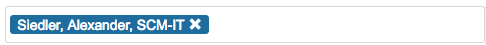
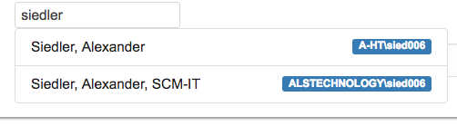

# ng2-people-picker

a SharePoint 2013 people picker for an angular2 app. It will use the following rest call to give user suggestions based on the search string:
> /_api/SP.UI.ApplicationPages.ClientPeoplePickerWebServiceInterface.clientPeoplePickerSearchUser


- [ng2-people-picker](#ng2-people-picker)
  - [Look](#look)
    - [with user](#with-user)
    - [search result](#search-result)
  - [Installation](#installation)
  - [Dependencies](#dependencies)
  - [Use the library](#use-the-library)
  - [Data Input/Output](#data-inputoutput)
    - [WebEnsureUserResult](#webensureuserresult)
  - [License](#license)

## Look 
### with user

### search result


## Installation

To install this library, run:

```bash
$ npm install ng2-people-picker --save
```

## Dependencies

* Bootstrap for glyphicon glyphicon-remove
* sp-pnp-js
  * es6-promise
  * whatwg-fetch

## Use the library

Import the Module into your Angular `AppModule`:

```typescript
import { BrowserModule } from "@angular/platform-browser";
import { NgModule } from "@angular/core";

import { AppComponent } from "./app.component";

// Import your library
import { PeoplePickerModule } from "ng2-people-picker";

@NgModule({
  declarations: [AppComponent],
  imports: [
    BrowserModule,

    // Specify your library as an import
    PeoplePickerModule.forRoot()
  ],
  providers: [],
  bootstrap: [AppComponent]
})
export class AppModule {}
```

Once your library is imported, you can use its components in your Angular application:

```xml
<!-- You can now use the module in app.component.html -->
<ng2-people-picker-component [(selectedPersons)]="Array with SP-Users" [maxUsers]="Number" [disable]="boolean"></ng2-people-picker-component>
```

## Data Input/Output

| name            | type                                                                      |
| --------------- | ------------------------------------------------------------------------- |
| selectedPersons | array of SiteUserProps users from an ensureUser function from sp-pnp-js. |
| maxUsers        | number, minimun 1                                                         |
| disable         | boolean, true or false(grey background and not-allows cursor)             |

### WebEnsureUserResult

Afterwards the user was selected from the search result we make an ensureUser call to get the proper sharepoint user and store the data: SiteUserProds in the array:

```javascript
export interface SiteUserProps {
  Email: string;
  Id: number;
  IsHiddenInUI: boolean;
  IsShareByEmailGuestUser: boolean;
  IsSiteAdmin: boolean;
  LoginName: string;
  PrincipalType: number;
  Title: string;
}
```

## License

MIT © [Alexander Siedler](mailto:alex.siedler@gmail.com)
